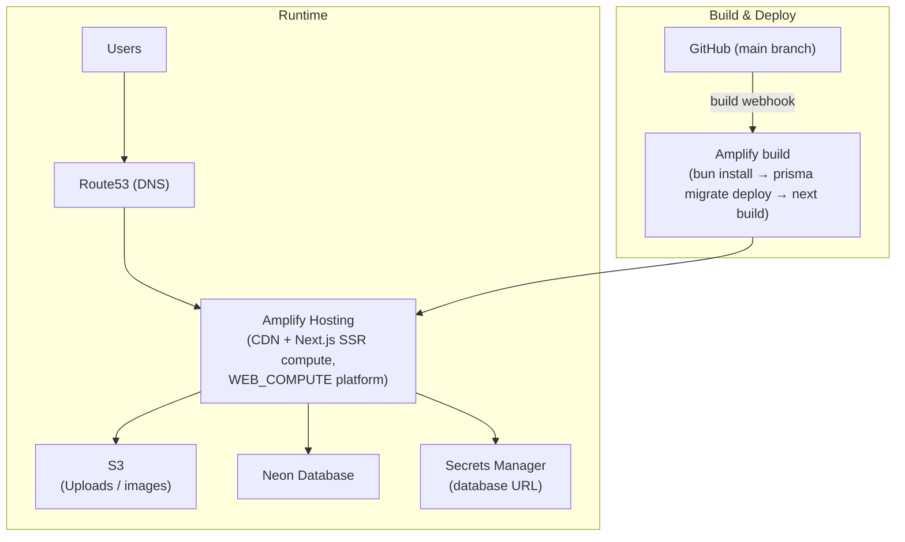
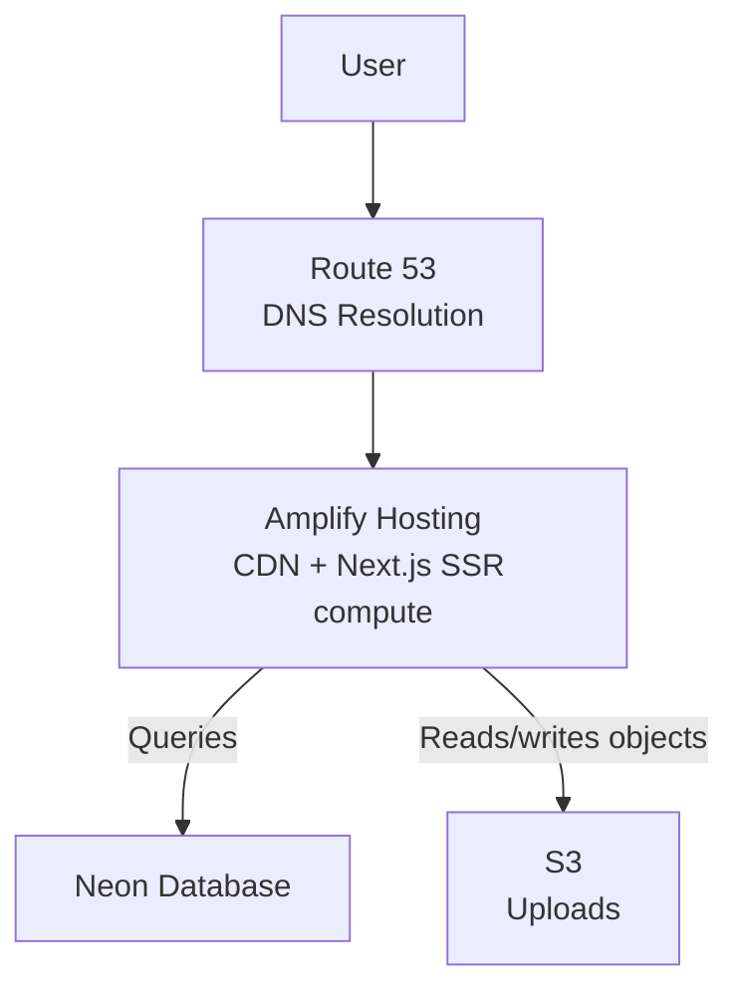

# AWS Architecture

One app (`apps/nextjs`) runs on **AWS Amplify Hosting**
(`platform = WEB_COMPUTE`), talking to Neon Postgres and S3 directly. There is
no separate backend service. Amplify owns its own CDN, build pipeline, and SSR
compute — this repo's Terraform provisions the app, its IAM roles, the S3
buckets, the database secret, and the DNS records Amplify's domain
verification needs, but no CDN, no container image, and no edge-function
layer of its own:

```
client → Amplify (CDN + Next.js SSR compute) → Neon Postgres + S3
```



## Request routing

Amplify serves everything from the one app — pages, `/api/*` route handlers,
and `/_next/static/*` — through its own managed CDN and SSR compute; there is
no separate origin, cache behavior, or edge function for this repo to define.
`cache_config { type = "AMPLIFY_MANAGED" }` on `aws_amplify_app` opts into
Amplify's own caching for the platform, rather than hand-rolling cache
policies the way a self-managed CloudFront distribution would need.



## IAM

`infra/modules/iam` creates two roles, both trusted only by
`amplify.amazonaws.com`:

| Role               | Assumed                                           | Grants                                                                                                                                                     |
| ------------------ | ------------------------------------------------- | ---------------------------------------------------------------------------------------------------------------------------------------------------------- |
| SSR compute role   | Per-request, at runtime (`compute_role_arn`)      | `s3:GetObject` on the uploads bucket; `secretsmanager:GetSecretValue` on the database secret                                                               |
| Build service role | During the Amplify build (`iam_service_role_arn`) | `secretsmanager:GetSecretValue` on the database secret, so `amplify.yml`'s preBuild step can resolve `DATABASE_URL` before running `prisma migrate deploy` |

Neither role can reach anything outside these two scoped statements — no
account-wide S3 or Secrets Manager access.

## DNS

Amplify's domain association needs two CNAME records verified in the app's
Route 53 zone (certificate verification, and the subdomain itself pointing at
Amplify). `infra/modules/amplify/locals.tf` parses those out of
`aws_amplify_domain_association`'s attributes (`sub_domain` is an unordered
set, so the subdomain record is selected by its known prefix rather than
indexed), and the root module's `route53` module writes them into the zone —
cross-account, via the `aws.dns` provider alias, when the zone lives outside
this AWS account.

`wait_for_verification = false` on the domain association is deliberate:
`true` would deadlock, since it blocks on DNS records that this same apply
creates as its own output.

## Deployment

Amplify deploys the app itself, independent of GitHub Actions: pushing to the
configured branch fires Amplify's own build webhook (created via
`access_token` on `aws_amplify_app` — AWS never returns that token on read,
so re-supplying the same value on a later `terraform apply` is safe and
expected). The build spec is the repo-committed root `amplify.yml`
(`bun install` → resolve `DATABASE_URL` from Secrets Manager → `prisma
migrate deploy` → `next build`). GitHub Actions' `deploy.yml` only ever
applies this repo's Terraform for infra changes — it has no app-deploy job.

**This is an accepted reduction in deployment safety.** A build's output
reaches 100% of traffic once it goes live, and there is no alarm-gated
automatic rollback. Recovery is redeploying a previous build; see
[`deployment-environments.md`](deployment-environments.md#rollback) for the
procedure and [`runbook.md`](runbook.md) for the operator steps.

## Architecture notes

1. **Caching.** Amplify manages its own CDN caching for `WEB_COMPUTE` apps —
   there are no cache behaviors or edge TTLs for this Terraform to configure.
2. **Security.** The SSR compute and build service roles are scoped to the
   exact S3 bucket and Secrets Manager secret they need; nothing else in the
   account is reachable through them.
3. **No S3 access-log bucket.** The uploads bucket has no dedicated
   access-log destination bucket (there was one; it was removed) — the
   underlying Trivy check for missing S3 access logging (`AVD-AWS-0089`) is
   LOW severity and isn't part of `security.yml`'s `CRITICAL,HIGH` gate, and
   an audit trail of individual object accesses wasn't judged worth the
   extra bucket for this app. See `deployment-environments.md#hardening` for
   the full reasoning.
4. **WAF, no maintenance mode.** A WAFv2 Web ACL (`infra/modules/waf`)
   associates directly with the Amplify app's ARN — no CloudFront
   distribution is needed for this, since `aws_wafv2_web_acl_association`
   accepts an Amplify app ARN as `resource_arn`. The Web ACL itself must be
   `CLOUDFRONT` scope, not `REGIONAL` — Amplify rejects a regional one
   outright — and AWS manages `CLOUDFRONT` scope exclusively via the
   `us-east-1` endpoint, hence the dedicated `aws.waf` provider alias, even
   though the app itself runs in `ap-northeast-1`. It runs in count-only
   mode initially. Maintenance mode still doesn't exist; adding it is a
   deliberate decision, not a default this repo maintains.
