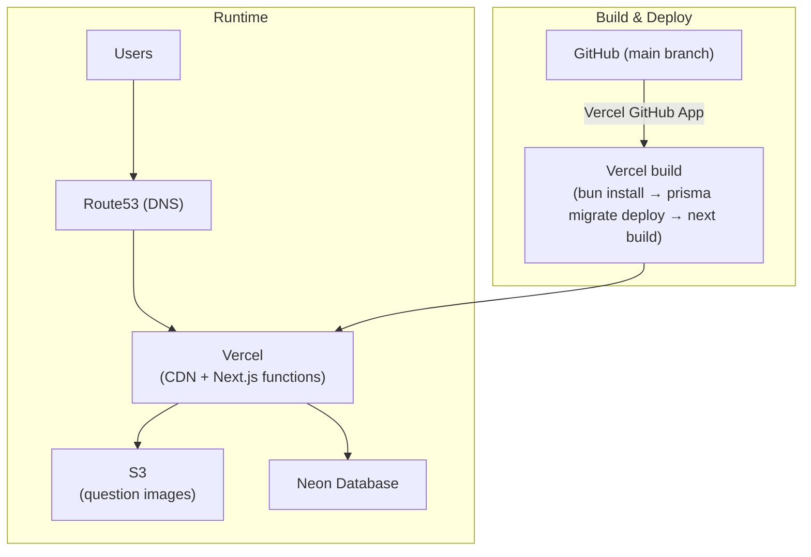

# Architecture

One app (`apps/nextjs`) runs on **Vercel** (Hobby plan), talking to Neon
Postgres and S3 directly. There is no separate backend service. Vercel owns the
CDN, build pipeline, and serverless compute; this repo's Terraform manages the
AWS side only: the S3 bucket for question images and the Route 53 records for
the app's domain. It runs no CDN, container image, or edge-function layer of
its own:

```
client → Vercel (CDN + Next.js functions) → Neon Postgres + S3
```


```mermaid
flowchart TD
    subgraph "Runtime"
        Users["Users"]
        Route53["Route53 (DNS)"]
        Vercel["Vercel<br/>(CDN + Next.js functions)"]
        S3Uploads["S3<br/>(question images)"]
        NeonDB["Neon Database"]
    end

    subgraph "Build & Deploy"
        GitHub["GitHub (main branch)"]
        VercelBuild["Vercel build<br/>(bun install → prisma migrate deploy → next build)"]
    end

    Users --> Route53
    Route53 --> Vercel
    Vercel --> S3Uploads
    Vercel --> NeonDB

    GitHub -->|Vercel GitHub App| VercelBuild
    VercelBuild --> Vercel
```

> **Status:** the Vercel project, its environment variables, the custom domain,
> and the IAM role its functions assume are not in Terraform yet. They land
> with the Vercel module. Until then, `infra/` manages only the S3 bucket and
> the (empty) DNS record set.
>
> **History:** the app previously ran on AWS Amplify Hosting, with a WAFv2 Web
> ACL and a Secrets Manager secret for `DATABASE_URL`. All three were removed
> to cut cost for a single-user app.

## Request routing

Vercel serves everything from the one app (pages, `/api/*` route handlers, and
`/_next/static/*`) through its own CDN and functions. There is no separate
origin, cache behavior, or edge function for this repo to define.

## Configuration and secrets

Every runtime value is a **server-only** environment variable, validated in
`apps/nextjs/src/config/env.ts`:

| Variable         | Where it comes from when deployed                                  |
| ---------------- | ------------------------------------------------------------------ |
| `DATABASE_URL`   | Vercel env var (sensitive, production only)                        |
| `S3_BUCKET_NAME` | Vercel env var                                                     |
| `AWS_REGION`     | Vercel env var (Vercel otherwise sets it to the function's region) |
| `AWS_ROLE_ARN`   | Vercel env var: the role the S3 client assumes via Vercel OIDC     |

There is no `NEXT_PUBLIC_*` variable and nothing is inlined into the bundle at
build time.

## IAM

The S3 client (`src/lib/s3.ts`) gets short-lived credentials through **Vercel
OIDC federation**: when `AWS_ROLE_ARN` is set, it exchanges the function's
Vercel OIDC token for that role's credentials. There are no static AWS access
keys anywhere. That role is trusted only by this Vercel project's production
environment and allows `s3:GetObject` on the images bucket. It is added with
the Vercel module, alongside the account-level Vercel OIDC identity provider
in the org repo.

Locally `AWS_ROLE_ARN` stays unset and the SDK uses the developer's own AWS
credential chain.

## DNS

The root `route53` module writes CNAME records into the app's Route 53 zone.
When the zone lives outside this AWS account, it writes them cross-account via
the `aws.dns` provider alias. It currently writes no records; the Vercel
module adds the app's CNAME to Vercel.

## Deployment

Vercel deploys the app itself, independent of GitHub Actions: pushing to
`main` triggers a production build through Vercel's GitHub App. The build spec
is `apps/nextjs/vercel.json`: `prisma migrate deploy` runs strictly before
`next build` (joined by `&&`, so a failed migration fails the deployment).
GitHub Actions' `deploy.yml` only ever applies this repo's Terraform for infra
changes; it has no app-deploy job.

A production build reaches 100% of traffic once it goes live, and there is no
alarm-gated automatic rollback. Recovery is Vercel's Instant Rollback to a
previous production deployment. See
[`deployment-environments.md`](deployment-environments.md#rollback) for the
procedure.

## Architecture notes

1. **Caching.** Vercel manages its own CDN caching; there are no cache
   behaviors or edge TTLs for this Terraform to configure.
2. **No S3 access-log bucket.** The images bucket has no dedicated access-log
   destination bucket (there was one; it was removed). The Trivy check for
   missing S3 access logging (`AVD-AWS-0089`) is LOW severity and isn't part of
   `security.yml`'s `CRITICAL,HIGH` gate, and an audit trail of individual
   object accesses wasn't judged worth the extra bucket for this app. See
   `deployment-environments.md#hardening` for the full reasoning.
3. **No WAF, no maintenance mode.** The former count-only AWS WAF was removed
   with Amplify; Vercel's built-in platform firewall is the only edge
   protection. Maintenance mode doesn't exist; adding it would be a deliberate
   decision, not a default this repo maintains.
